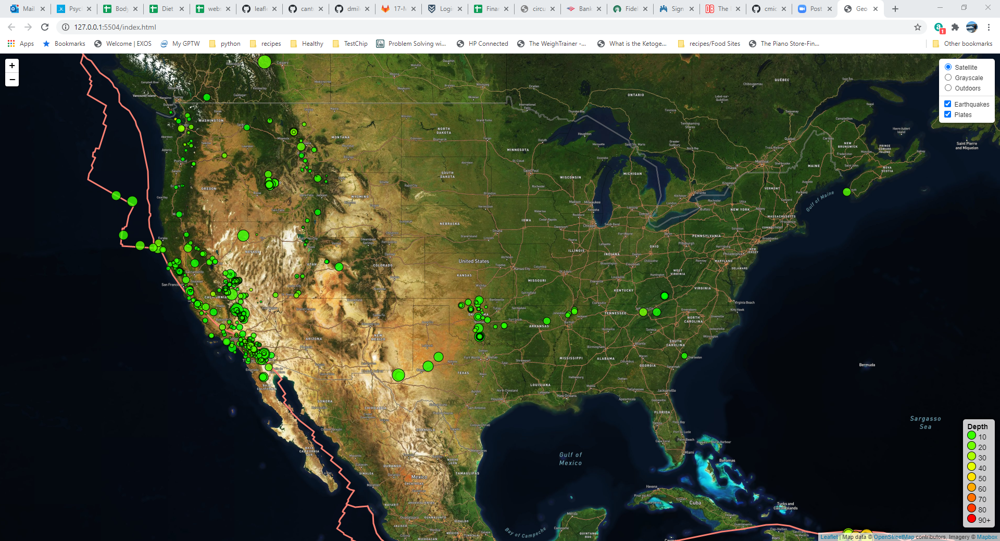
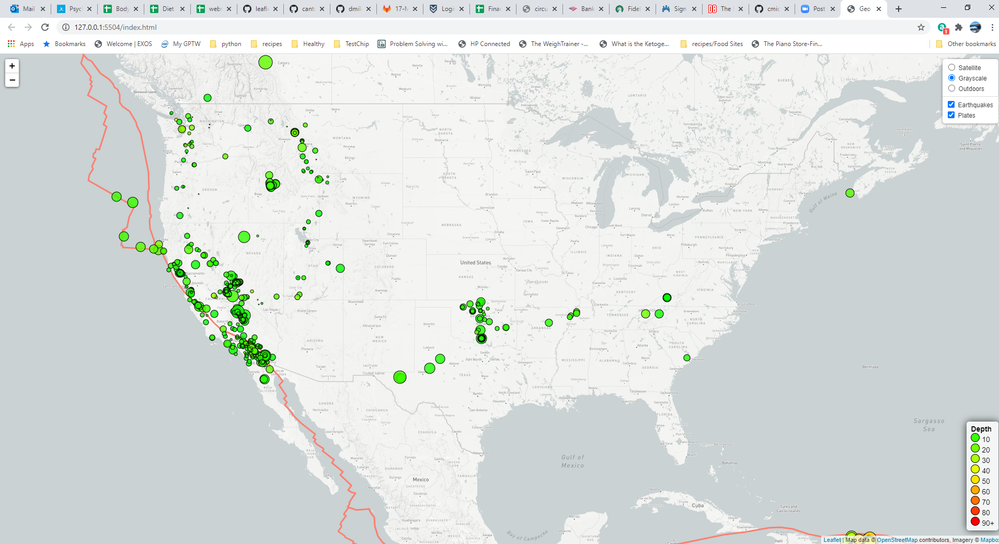
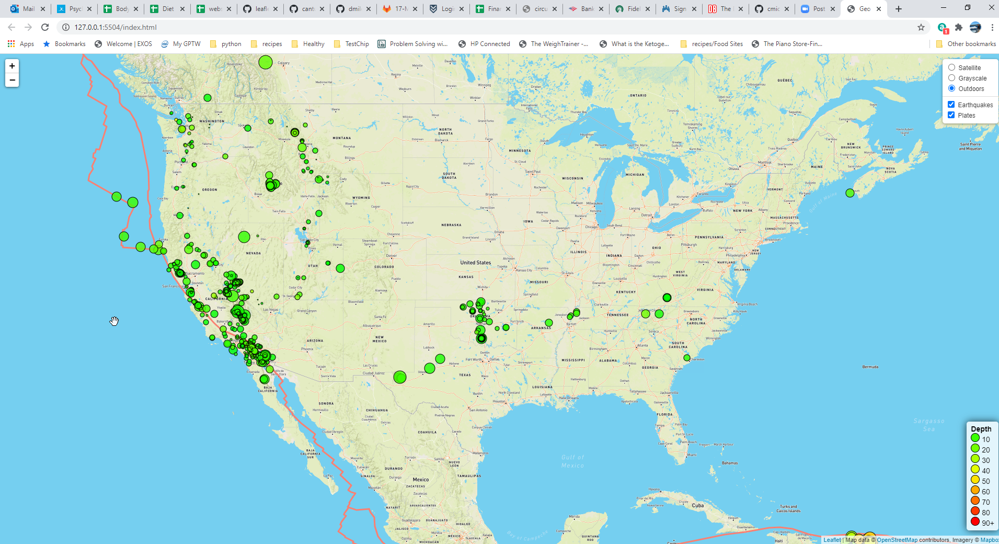

# leaflet-challenge

Requirements:

* This code requires one to put a static/js/config.js file in place. This file should only contain one line as shown below. With "YOUR API KEY HERE!" being replaced by a valid MapBox API key.

  * const API_KEY = "YOUR API KEY HERE!";

This web site is a visualization of [USGS earthquake data](https://earthquake.usgs.gov/earthquakes/feed/v1.0/geojson.php) using the Leaflet.js library. The data used were all the earthquakes from the past 7 days. The visualization tool used to create this map is Leaflet combined with the [Mapbox API](https://www.mapbox.com/). Various map skins were used as  layers in this visualization.

This map contains the locations, magnitude, and time of recent earthquakes around the world. The magnitude is indicated by the bubble size/color. A pop up window will appear if the user clicks on a bubble and return more information about the earthquake. A [tectonic plate layer](https://github.com/fraxen/tectonicplates) is also added to the map to show how close most earthquakes are to the earth's tectonic plates. The visualization is set so that the maps do not wrap, I used the noWrap feature. This only partially worked due to a MapBox bug. The resource that I used to get around this is [here](https://stackoverflow.com/questions/47477956/nowrap-option-on-tilelayer-is-only-partially-working). Note: the legend and the colors chosen within it are implemented programmatically and can change easily based upon changing a single array.

Sample images of visualizations with different map layers:

## Satellite Map

## Grayscale Map

## Outdoors Map

